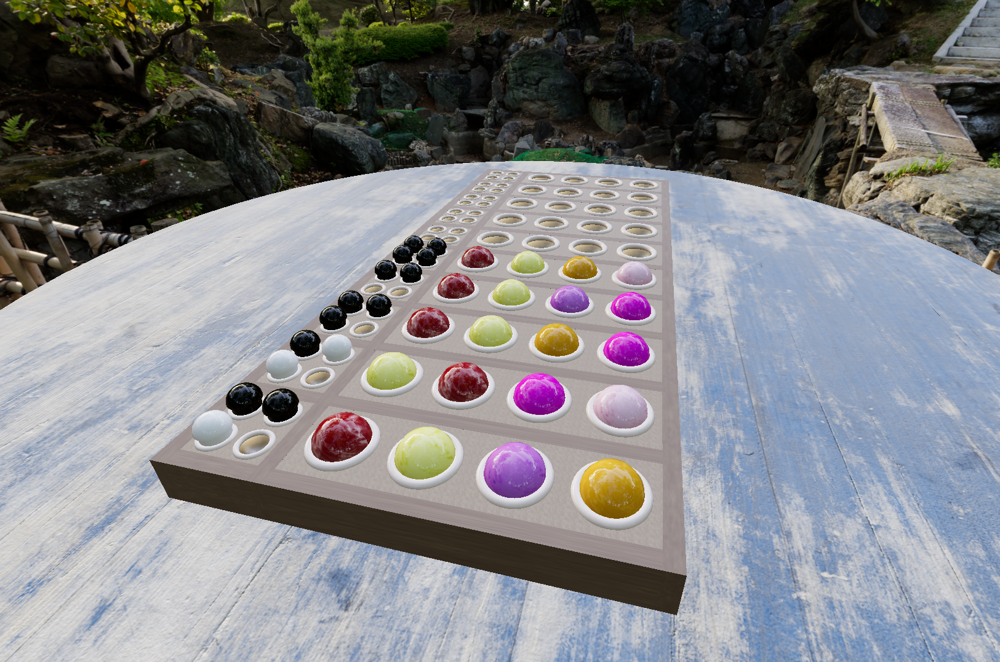

# Mastermind

Mastermind is a tabletop game for 2 players where one player submits a hidden code in a selected range of colors, and the opposing player is tasked with finding the code.

The project aimed at learning the basics of building 3D environments in games. For that purpose, the project uses [Three.js](https://threejs.org/) to render all the geometry in-game.

I am self-hosting the game, so you can [try it for yourself!](https://mastermind.pedromariaferreira.com/)



# Description

This project is implemented as a single-player game using Javascript, pitting the player against the CPU to find the secret code. The game has a customizable difficulty, being able to select the number of colors available, code size, number of tries, and color repeatability.

# Installation

Inside your working directory, you need to install the dependencies using [npm](https://www.npmjs.com/) with:

```bash
npm install
```

For the textures, you will need to download the following and add in the following structure:

```bash
├── textures
│   ├── background.hdr #I used this background, but any HDRi is fine: https://dl.polyhaven.org/file/ph-assets/HDRIs/hdr/8k/ninomaru_teien_8k.hdr
│   ├── metal057 #Copper texture. Download: https://ambientcg.com/get?file=PaintedWood007B_2K-PNG.zip
│   │   ├── Metal057A_2K-PNG_Color.png
│   │   ├── Metal057A_2K-PNG_Displacement.png
│   │   ├── Metal057A_2K-PNG_Metalness.png
│   │   ├── Metal057A_2K-PNG_NormalGL.png
│   │   └── Metal057A_2K-PNG_Roughness.png
│   ├── paintedWood007 #Painted wood. Download: https://ambientcg.com/get?file=PaintedWood007B_2K-PNG.zip
│   │   ├── PaintedWood007B_2K-PNG_Color.png
│   │   ├── PaintedWood007B_2K-PNG_NormalGL.png
│   │   └── PaintedWood007B_2K-PNG_Roughness.png
│   ├── wood022 #Light wood texture. Download: https://ambientcg.com/get?file=Wood022_2K-PNG.zip
│   │   ├── Wood022_2K-PNG_Color.png
│   │   ├── Wood022_2K-PNG_NormalGL.png
│   │   └── Wood022_2K-PNG_Roughness.png
│   ├── wood039 #Dark rough wood texture. Download: https://ambientcg.com/get?file=Wood039_2K-PNG.zip
│   │   ├── Wood039_2K-PNG_Color.png
│   │   ├── Wood039_2K-PNG_NormalGL.png
│   │   └── Wood039_2K-PNG_Roughness.png
│   └── wood077 #Brown wood texture. Download: https://ambientcg.com/get?file=Wood077_2K-PNG.zip
│       ├── Wood077_2K-PNG_Color.png
│       ├── Wood077_2K-PNG_NormalGL.png
│       └── Wood077_2K-PNG_Roughness.png
```

If you want to use other textures, you will need to make changes in the world.js file.

# Usage

You can run the game locally using npm and [Vite](https://vite.dev/). Create a dev environment with Vite and run the project with:

```bash
npm run dev
```

If you prefer to use [Docker](https://www.docker.com/), I have added a Dockerfile and docker-compose.yml template for you to build your own Docker image. To do so, you can do for example:

```bash
docker build . -t "mastermind:latest"
```

Followed by:

```bash
docker compose up -d
```